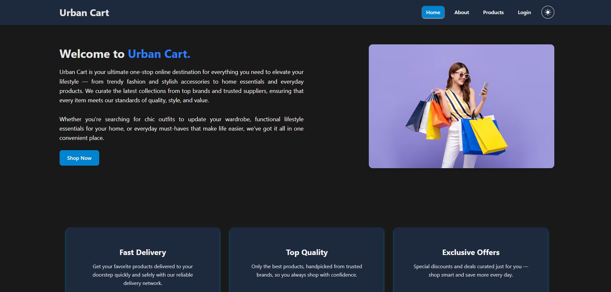
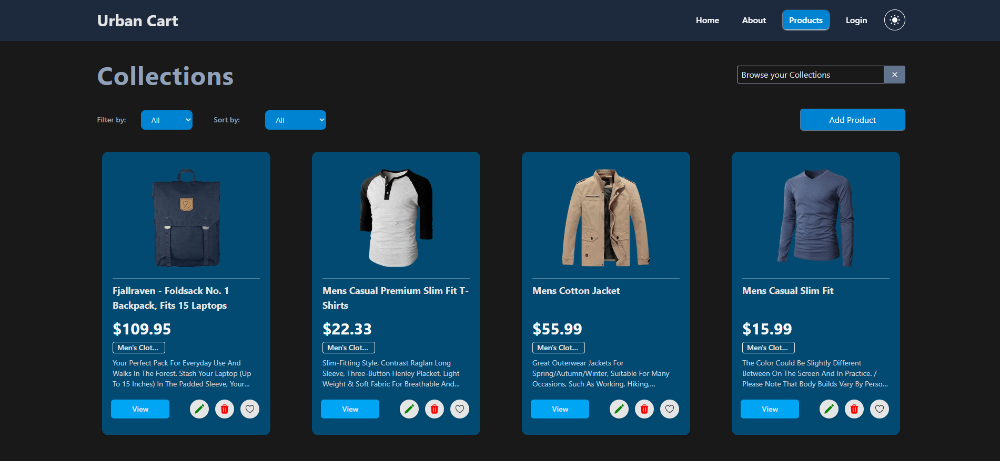
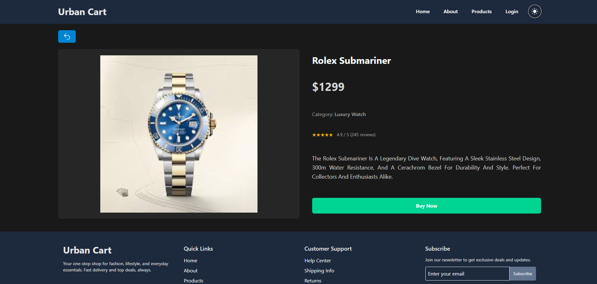

# 🛒 Urban Cart - E-Commerce Website

[](https://reactjs.org/)
[](https://redux-toolkit.js.org/)
[](https://tailwindcss.com/)
[](https://axios-http.com/)
[](https://vitejs.dev/)
[](https://www.npmjs.com/)

**Urban Cart** is a modern **React e-commerce application** with full **CRUD functionality**, dynamic **JSON data fetching**, and a sleek **Tailwind CSS UI**. It uses **Axios** for HTTP requests and includes features like product filtering, sorting, and a responsive **Light/Dark theme**.

---

## 📸 Sneak Peek

### Home Page



### Product Detail



### Description Page



## 🎥 App Showcase

### Phase - 1


### Phase - 2


---

## 📋 Table of Contents

- [Demo](#-demo)
- [Features](#-features)
- [Tech Stack](#-tech-stack)
- [Installation](#-installation)
- [Usage](#-usage)
- [Folder Structure](#-folder-structure)
- [Environment Variables](#-environment-variables)
- [Contributing](#-contributing)
- [License](#-license)
- [Acknowledgements](#-acknowledgements)
- [Contact](#-contact)

---

## 🔧 Key Features

- **CRUD Operations**:
  - **Create** new products
  - **Read** product details (list + detail page)
  - **Update** existing products
  - **Delete** products
- **Dynamic JSON API** using Axios
- **Search, Filter & Sort** products by category, title, price, etc.
- **Light / Dark Theme Toggle** with persistence
- **Responsive UI** with TailwindCSS
- **Sidebar Modal** for Add/Edit product
- **Smooth Animations** and transitions for UI interactions
- **Persistent State** (products sync with backend)
- **Optimistic Updates** for fast UI response during CRUD operations

---

## 🗂 Project Structure

```bash
urban-cart
│
├── node_modules                # Project dependencies installed by npm
├── public                      # Static files that will be served directly
│ └── vite.svg                  # Example static image file
├── src                         # Main source code of the application
│ ├── assets                    # Images, icons, fonts, etc.
│ ├── Components                # Reusable React components
│ │ ├── Footer.jsx              # Footer component
│ │ ├── LeftSideBar.jsx         # Sidebar component
│ │ ├── Navbar.jsx              # Navigation bar component
│ │ ├── ProductCard.jsx         # Individual product card component
│ │ └── ProtectedRoute.jsx      # Route guard for protected pages
│ ├── contexts                  # React Context providers
│ │ └── AppProvider.jsx         # App-wide state management
│ ├── Pages                     # Application pages (views)
│ │ ├── About.jsx               # About page
│ │ ├── Description.jsx         # Product description page
│ │ ├── Home.jsx                # Homepage
│ │ ├── Login.jsx               # Login page
│ │ ├── NoPage.jsx              # 404 / Not found page
│ │ └── Products.jsx            # Products listing page
│ ├── Routes                    # React Router configuration
│ │ └── AllRoutes.jsx           # Defines all app routes
│ ├── App.js                    # Root component
│ ├── index.css                 # Global CSS styles
│ └── main.jsx                  # Entry point of the React app
├── .gitignore                  # Specifies files/folders Git should ignore
├── eslint.config.js            # ESLint configuration for code linting
├── index.html                  # Main HTML template
├── package-lock.json           # Auto-generated file for package versions
├── package.json                # Project metadata and dependencies
├── README.md                   # Project documentation
└── vite.config.js              # Vite configuration file
```

## 🛠 Tech Stack

| Feature / Technology | Description                   |
| -------------------- | ----------------------------- |
| React                | Frontend UI library           |
| Redux Toolkit        | State management              |
| Tailwind CSS         | Styling and responsive design |
| Axios                | HTTP client for API calls     |
| Vite                 | Fast build tool               |
| JSON API             | Backend data source           |

---

## 🚀 Installation

### Prerequisites

- Node.js >= 18
- npm or pnpm

### Steps

1. Clone the repository:

```bash
    git clone https://github.com/yourusername/urban-cart.git
    cd urban-cart
```

2. Install dependencies:

```bash
    npm install
        # or
    pnpm install
```

3. Run the project:

```bash
    npm run dev
```

## 💻 Usage

- Navigate through the **homepage**, **products**, and **description pages**.
- **Add, edit, or delete products** using the sidebar modal.
- Use **search, filter, and sort features** to explore products.
- Toggle **Light/Dark theme** with the switch in the navbar.
- **Protected routes** prevent unauthorized access to certain pages.

## 🤝 Contributing

1. **Fork the project**
2. **Create a feature branch**:
   ```bash
   git checkout -b feature-name
   ```
3. **Commit your changes**:
   ```bash
    git commit -m "Add feature"
   ```
4. **Push to branch**:

   ```bash
    git push origin feature-name
   ```

## 📫 Contact

- **GitHub**: [Rohit-Pakhre09](https://github.com/Rohit-Pakhre09)
- **LinkedIn**: [Rohit Pakhre](https://www.linkedin.com/in/rohit-pakhre/)
- **Email**: pakhrerohit281@gmail.com
